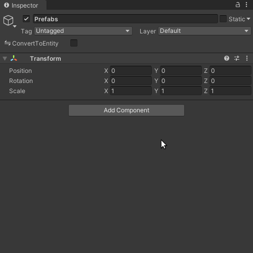

# Reese's Entity Prefab Groups

Create and reference groups of entity prefabs with ease.

## Import

Copy one of the below Git URLs:

* **HTTPS:** `https://github.com/reeseschultz/ReeseUnityDemos.git#epg`
* **SSH:** `git@github.com:reeseschultz/ReeseUnityDemos.git#epg`

Then go to `Window ⇒ Package Manager` in the editor. Press the `+` symbol in the top-left corner, and then click on `Add package from git URL`. Paste the text you copied and finally click `Add`.

## Usage

This package lets you create entity prefab groups—groups of prefabs converted into entities.

For a deep dive on using this package to spawn prefabs, see [this blog post](https://reese.codes/blog/post/spawning-prefabs-with-unity-dots/).

A group is great for organizational purposes. Perhaps all weapons belong in the `Weapons` group, or maybe you'll have a `Characters` group for your players and NPCs. What's more, this package enables you to get a `DynamicBuffer` of all prefab entities belonging to a given group. One good reason to use this package is if you want to select a random prefab from a group of variants.

To get started, create an empty GameObject in a scene.


Next, add a `PrefabEntityGroup` component to said GameObject. Doing so will automatically add the `ConvertToEntity` script to this GameObject with the *Convert And Destroy* conversion mode, which is what you want. Then add prefabs to the group's list.



Your prefabs and their children do *not* need `ConvertToEntity` scripts on them; however, you *can* supply authoring (`IConvertGameObjectToEntity`) scripts for them. This is recommended so that they have queryable, custom components attached to their entity conversions. Unity's existing procedures will take care of references between prefab members and GameObjects that are converted into entities, making it easy to read/write multiple entities with one "controller" component in a system.

Anyway, after adding your prefabs to that list, you can now do something like this:

```csharp
using Reese.EntityPrefabGroups;
using Unity.Entities;
using Unity.Collections;

public class SomeSystem : SystemBase
{
    protected override void OnUpdate()
    {
        // Get a single entity prefab with a singleton component type:
        Entity donutShop = EntityManager.GetPrefab<DonutShop>();

        // The above assumes that a DonutShop authoring script is attached to a prefab.
        // Expect a runtime error if the component doesn't exist, or isn't a singleton.

        ...

        // Get a DynamicBuffer of entity prefabs in a group with a singleton component type:
        DynamicBuffer<PrefabGroup> hairStyles = EntityManager.GetPrefabs<HairStyles>();

        // The above assumes that a HairStyle authoring script is attached to a group.
        // Expect a runtime error if the component doesn't exist, or isn't a singleton.

        ...
    } 
}
```

Type inference via `var` is your friend, but the types in this example are explicit for demonstrational purposes.

`GetPrefab` and `GetPrefabs` are [extension methods](https://reese.codes/blog/post/how-extension-methods-work-in-csharp/) for the `EntityManager` that come with this package. The `PrefabGroup` is also a luxury of this package. A `PrefabGroup` element can be reinterpreted as an `Entity`. Entity conversion has never been so terse and tenable for tens, hundreds, and even thousands of prefabs. One great property of this system is that you are free to update the `PrefabGroup` at runtime, which you may need for streaming.

## Behind the Scenes

Each group is effectively an entity with a `DynamicBuffer<PrefabGroup>` component. During conversion, referenced prefabs are added to that buffer as entities. Assuming the group has a singleton component attached to it, you can get it with the shortened expressive power of the `GetPrefabs` extension method, as opposed to writing the query, and fetching the buffer, yourself. By the way, the singular `GetPrefab` does not actually require any `EntityPrefabGroup` in your scene, and will work without it.

## Contributing

Find a problem, or have an improvement in mind? Great. Go ahead and submit a pull request. Note that the maintainer, Reese, offers no assurance he will respond to you, fix bugs or add features on your behalf in a timely fashion, if ever, [unless you reach an agreement with him about support.](https://reese.codes)

By submitting a pull request, you agree to license your work under [this project's MIT license](https://github.com/reeseschultz/ReeseUnityDemos/blob/master/LICENSE).
